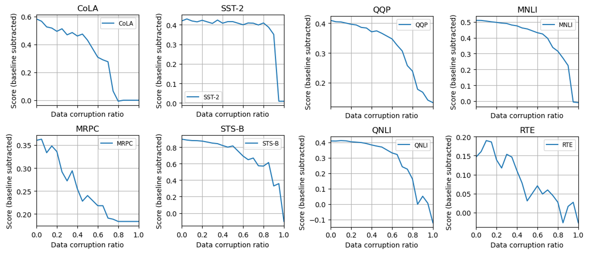
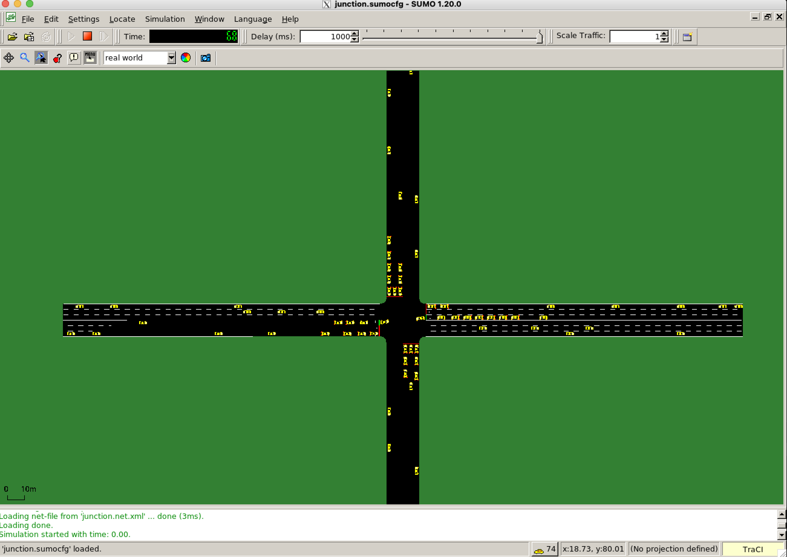
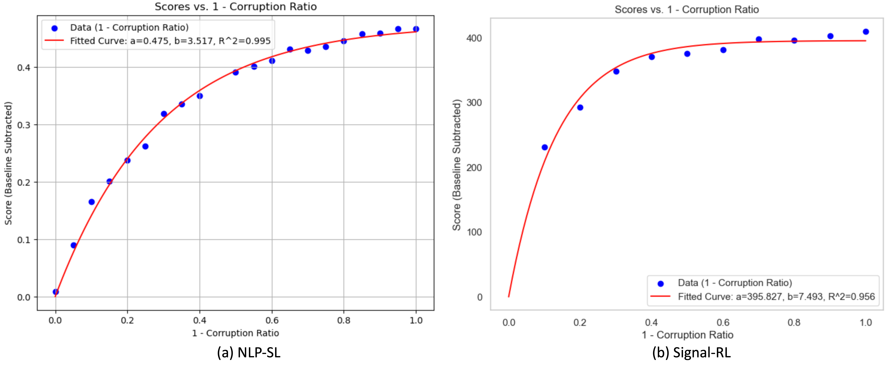
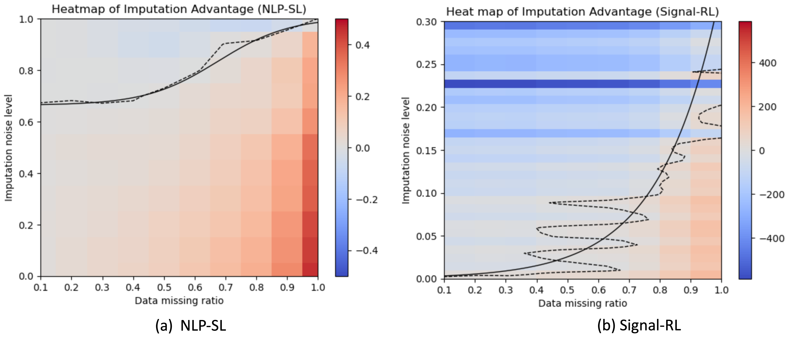
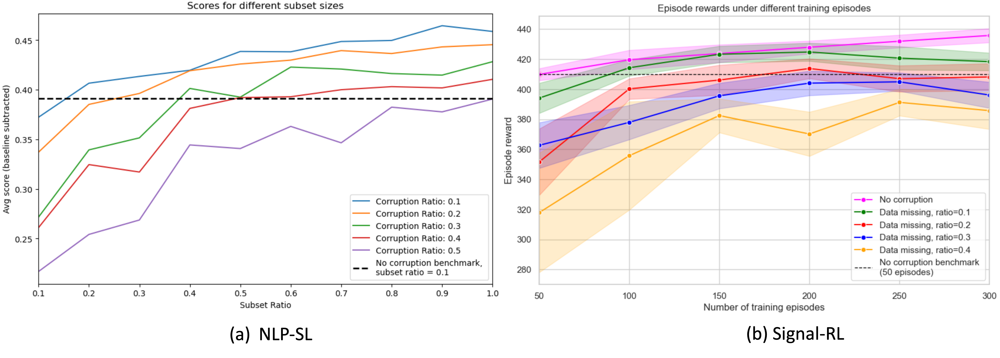

# Data corruption study

This repository contains the code and data used in the paper *Navigating Data Corruption in Machine Learning: Balancing Quality, Quantity, and Imputation Strategies*.

Contributors:
Qi Liu and Wanjing Ma

## Overview
### NLP-SL experiment
Folder ```NLP-SL``` contains the code and data for the NLP-SL experiment.

```bert_pretrain_using_wikitext_and_bookcorpus.ipynb``` is for BERT pretraining.

```bert_finetune_on_glue_tasks.py``` is for BERT finetuning on GLUE tasks.




### Signal-RL experiment
Folder ```Singnal-RL``` contains the code and data for the Signal-RL experiment.



### results visualization
See the following files for results visualization:

```results_analysis_part1.ipynb```


```results_analysis_part2.ipynb```


```results_analysis_part3.ipynb```
