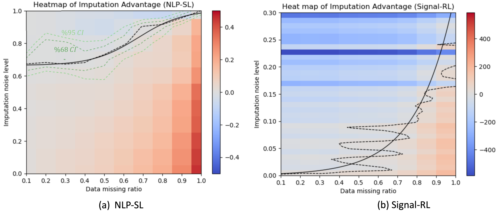

# Data corruption study

## Introduction
This repository contains the code and results from the paper *Navigating Data Corruption in Machine Learning: Balancing Quality, Quantity, and Imputation Strategies*.

Contributors:
Qi Liu and Wanjing Ma

## How to run the experiments
### NLP-SL experiment
Folder ```./NLP-SL/``` contains the code and running instructions for the NLP-SL experiment.

Check ```./NLP-SL/README.md``` for more details.


### Signal-RL experiment
Folder ```./Singnal-RL/``` contains the code and running instructions the Signal-RL experiment.

Check ```./Signal-RL/README.md``` for more details.


### Experiment results
Results of the experiments are saved at ```./save/```.
 - ```./save/the_effect_of_data_missing/``` contains the results of Sec 3. Learning with corrupted data; 
 - ```./save/imputation/``` contains the results of Sec 4. Effectiveness of Data Imputation; imputation method = "insert noise";
 - ```./save/imputation_wordvec/``` contains the results of Sec 4. Effectiveness of Data Imputation; imputation method = "wordvec";
 - ```./save/imputation_bert/``` contains the results of Sec 4. Effectiveness of Data Imputation; imputation method = "bert";
 - ```./save/can_enlarged_dataset_compensate/``` contains the results of Sec 5. Effectiveness of Enlarging Dataset.


## Visualization
See the following ipython files for results visualization. These scripts will use the results in ```./save/``` to generate figures.

Don't change the name of the folders and files in ```./save/```.

 - ```results_analysis_part1.ipynb```


 - ```results_analysis_part2.ipynb```


 - ```results_analysis_part3.ipynb```
